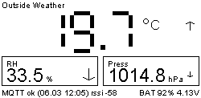

# Heltec Wireless Paper v1.1 – e‑ink dashboard (Wi‑Fi + MQTT)

<p align="center">
  
</p>

Firmware for **Heltec Wireless Paper v1.1 (ESP32‑S3)**: connects to Wi‑Fi, keeps MQTT connection alive, subscribes to telemetry, and renders values on the e‑ink display (temperature / humidity / pressure).

Key feature: **quiet boot** — after reset, firmware does *not touch e‑ink* (no "Booting/Connecting" screen) until valid mapped sensor data is received.

Target runtime mode is **battery-powered operation**. USB is primarily used for firmware upload and development monitoring, and only periodically for battery charging.

This project targets common IoT search intents around: **ESP32‑S3**, **Heltec Wireless Paper**, **e‑ink dashboard**, **MQTT telemetry display**, and **PlatformIO firmware**.

## Features

- ESP32‑S3 firmware for Heltec Wireless Paper v1.1 (2.13" e‑ink)
- MQTT telemetry ingest (plain numeric and JSON payloads)
- Configurable JSON key mapping (`temperature`, `relative_humidity`, `barometric_pressure`)
- Quiet boot with deferred display init (no unnecessary e‑ink flash on restart)
- Trend arrows for temperature / humidity / pressure (persisted across deep sleep via RTC memory)
- Battery voltage read + percent estimation
- AI-friendly structured logs (`event=... key=value`) for downstream automation
- Adaptive deep sleep v1 (cadence learning + confidence/fallback planning)

## Keywords

- heltec wireless paper v1.1
- esp32-s3 mqtt display
- e-ink weather station
- mqtt json telemetry parser
- platformio arduino firmware
- low-power e-paper dashboard

## Documentation language standard

- Canonical documentation in git is **English**.
- Canonical files keep original names (for example `README.md`).
- Local Polish helper copies use `_PL` suffix (for example `README_PL.md`) and are git-ignored.
- Operational rules for future agents are in `agent.md`.

## Requirements

- VS Code + **PlatformIO IDE** extension
- Heltec Wireless Paper v1.1
- USB connection only for development tasks (flash + Serial Monitor)
- Battery for normal field/runtime operation

## Configuration

1. Copy `include/secrets.h.example` to `include/secrets.h` and fill your values:
   - `WIFI_SSID`, `WIFI_PASSWORD`
   - `MQTT_HOST`, `MQTT_PORT`, optional `MQTT_USERNAME`, `MQTT_PASSWORD`
   - `MQTT_SUBSCRIBE_TOPIC` (can use wildcards, e.g. `home/+/telemetry`)
   - optional JSON field mapping: `JSON_TEMP_KEY`, `JSON_PRESSURE_KEY`, `JSON_HUMIDITY_KEY`

2. If needed, set board in `platformio.ini`:
   - default: `board = esp32-s3-devkitc-1`
   - if your PlatformIO has a dedicated Heltec board definition, switch to it.

## MQTT payload format

Supported payload formats:

- **Number** (string): `23.7`
- **JSON**:
   - flat: `{ "temperature": 23.7, "barometric_pressure": 993.2 }`
   - nested: `{ "payload": { "temperature": 23.7, "barometric_pressure": 993.2, "relative_humidity": 59.9 } }`

Notes:
- Numeric payload is interpreted as temperature.
- Numeric payload must be fully valid and finite (`finite`) after trimming trailing whitespace.
- Empty payloads and binary payloads with embedded `NUL` are ignored (logged as `MQTT`).
- If JSON has `timestamp` (epoch), firmware stores it and can show it in footer (`dd.mm hh:mm`).
- Messages without any mapped fields (temp/RH/pressure) **do not trigger screen refresh**.

## Example MQTT topics

Valid `MQTT_SUBSCRIBE_TOPIC` examples:

- single topic:
   - `home/outside/telemetry`
   - `sensors/weather/outside`
   - `msh/2/json/LongMod/!088a0574`
- wildcard:
   - `home/+/telemetry` (exactly one level)
   - `home/outside/#` (whole subtree)

If wildcards include mixed message types (telemetry + node info), screen refresh still happens only when mapped fields are present.

## Run

In PlatformIO:

- **Build**
- **Upload**
- **Monitor** (115200)

After development upload/verification, device is expected to run disconnected from USB (on battery), with USB used later only for maintenance and charging.

## Project structure

- `src/main.cpp` — firmware logic (Wi‑Fi, MQTT, parsing, rendering, AI logs)
- `include/secrets.h.example` — configuration template
- `include/secrets.h` — local secrets/config (git-ignored)
- `lib/heltec_wireless_paper_eink/` — vendored minimal display driver
- `platformio.ini` — PlatformIO environment/build config

### Screen layout

- Header: `MQTT_DEVICE_NAME`
- Large digits: temperature
- Tiles: humidity (RH) and pressure with trend arrow
- Footer:
   - left: MQTT status (`MQTT ok` / `MQTT wait`) + optional telemetry timestamp + RSSI
   - right: battery `BAT xx% yy.yyV`

### Serial Monitor logs

Firmware logs events with **milliseconds since boot** prefix:

- `BOOT`: reset reason + wakeup cause
- `WIFI`: connect/disconnect, timings, IP, RSSI
- `MQTT`: connect/subscribe + incoming messages
- `DATA`: whether payload updated mapped values
- `EINK`: display initialization (deferred)

### AI log contract

For future agent-driven development, firmware also emits structured lines:

- format: `[     millis|000123] AI: event=<name> key=value key=value ...`
- `000123` is a monotonically increasing log sequence number (helps when `millis` is equal)
- fields are flat `key=value` pairs (no nested JSON)

Current AI events:

- `session_start` — schema version, firmware version, topic, refresh settings
- `boot_info` — reset/wakeup/runtime info (sdk/cpu/heap)
- `mqtt_rx` — incoming frame (topic, len, rssi)
- `mqtt_rx_ignored` — ignored frame (`invalid_frame`, `empty`, `embedded_nul`)
- `mqtt_parse_error` — JSON parser error
- `data_update` — mapped values updated (`source=plain_float|json`, temp/hum/press, `refresh=1`)
- `data_noop` — no mapped fields (`refresh=0`)
- `mqtt_connect` / `mqtt_connect_skip` / `mqtt_subscribe` — connection lifecycle
- `display_refresh` — e‑ink refresh (`reason=dirty|periodic`)

## MQTT testing (without device)

If you have `mosquitto-clients`, you can publish test messages manually.

### Subscribe

```bash
mosquitto_sub -h 192.168.1.18 -p 1883 -t 'home/outside/telemetry' -v
```

### Publish plain temperature

```bash
mosquitto_pub -h 192.168.1.18 -p 1883 -t 'home/outside/telemetry' -m '21.7'
```

### Publish JSON

```bash
mosquitto_pub -h 192.168.1.18 -p 1883 -t 'home/outside/telemetry' \
   -m '{"timestamp":1771415462,"payload":{"temperature":1.01,"relative_humidity":68.56,"barometric_pressure":997.84}}'
```

### Retained test

Publish retained:

```bash
mosquitto_pub -h 192.168.1.18 -p 1883 -t 'test/ret' -m 'hello' -r
```

New subscriber should receive it immediately:

```bash
mosquitto_sub -h 192.168.1.18 -p 1883 -t 'test/ret' -C 1 -W 2 -v
```

Clear retained (null payload + `-r`):

```bash
mosquitto_pub -h 192.168.1.18 -p 1883 -t 'test/ret' -n -r
```

## E‑ink refresh notes

Tune in `include/secrets.h`:

- `DISPLAY_MIN_REFRESH_MS` — minimum interval between refreshes
- `DISPLAY_PERIODIC_REFRESH_MS` — periodic refresh even without new data

Important:
- if `DISPLAY_PERIODIC_REFRESH_MS = 0`, refresh happens only on new data
- periodic mode starts only after first valid data arrives (to avoid empty flashing).

## Battery

Wireless Paper v1.x uses VBAT measurement via ADC (default config):

- `BATTERY_ADC_PIN` — VBAT ADC (GPIO20)
- `BATTERY_ADC_CTRL_PIN` — divider/measurement control (GPIO19, active LOW)
- `BATTERY_DIVIDER` — calibration multiplier (details in `include/secrets.h`)

## Deep sleep status

- **Adaptive deep sleep v1: DONE**
   - Initial phase: continuous listening (no sleep) until minimum environmental cadence intervals are learned.
   - Learns cadence from timestamped environmental updates (temperature / humidity / pressure).
   - Filters short burst intervals using `DEEPSLEEP_LEARN_MIN_INTERVAL_SEC` (learning only; messages are still processed immediately).
   - Supports broker retained-flag override (`retain_poll_15m` / `adaptive`) for event-driven sensors.
   - If override flag disappears, firmware resets learning and returns to fresh adaptive training.
   - Uses robust interval stats (median + MAD) and confidence scoring.
   - Falls back to conservative wake schedule when confidence is low.
   - Safety guards prevent runaway sleep loops (minimum awake time, MQTT-required sleep arming, empty-cycle inhibit).
   - Emits AI logs for `cadence_update`, `cadence_miss`, `sleep_plan`, `sleep_enter`, `sleep_wake`.
   - Additional AI logs for mode flow: `mode_flag`, `mode_switch`, `sleep_inhibit`.

Implementation spec v1: `docs/adaptive-deepsleep-spec-v1.md`

To enable on device, set in `include/secrets.h`:
- `DEEPSLEEP_ENABLE 1`
- Optional tuning: `DEEPSLEEP_MIN_INTERVAL_SAMPLES` (default `2`, sleep can start after ~3 environmental updates)
- Optional tuning: `DEEPSLEEP_CONFIDENCE_MIN` (higher = stricter adaptive entry, lower = earlier adaptive entry; too high can keep device in fallback loop)
- Optional tuning: `DEEPSLEEP_FALLBACK_SEC` (fallback sleep while training / low confidence)
- Optional tuning: `DEEPSLEEP_MAX_SEC` (upper bound for slow sensors, e.g. 45+ min cadence; increase above 1800 for slow or variable cadence deployments)
- Optional retained override topic: `DEEPSLEEP_RETAIN_MODE_TOPIC`
- Optional safety tuning: `DEEPSLEEP_MIN_AWAKE_SEC`, `DEEPSLEEP_MAX_EMPTY_SLEEP_CYCLES`

## E‑ink screenshots

Firmware dumps the raw framebuffer over Serial after every display refresh.
You can capture and convert it to a PNG:

1. Connect USB and open **Serial Monitor** (115200 baud).
2. Wait for a display refresh — Serial output will contain a base64 block between
   `---FRAMEBUFFER_START---` and `---FRAMEBUFFER_END---` markers.
3. Copy that entire block (including markers) into a text file, e.g. `dump.txt`.
4. Run the decoder:

```bash
python3 tools/decode_screenshot.py dump.txt docs/screenshot.png
```

The script has **no dependencies** beyond Python 3 standard library.
Output is a 250×122 px grayscale PNG cropped to the visible e‑ink area.

Files:
- `tools/decode_screenshot.py` — framebuffer-to-PNG converter
- `dump.txt` — example raw dump (git-ignored)
- `docs/screenshot.png` — latest captured screenshot

## License status

Licensed under the MIT License. See `LICENSE`.
